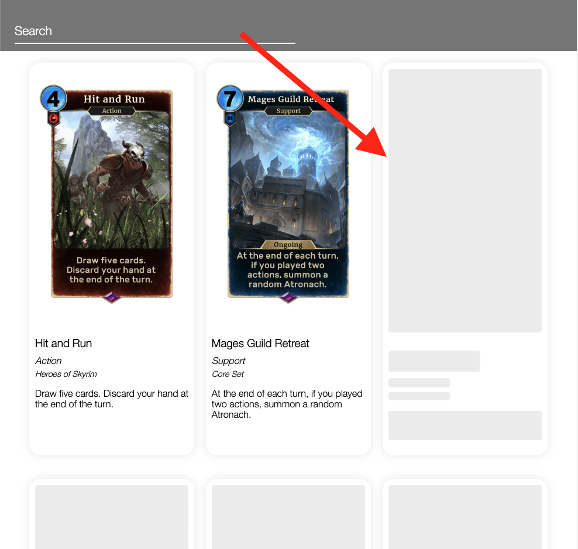

# hs-elder-scrolls

## Demo

Site hosted on [Netlify](https://cranky-archimedes-3dc676.netlify.com/)

## About

Highspot's coding challenge. Fetches records from the [Elder Scrolls Legends API](https://docs.elderscrollslegends.io/) and renders them as a card grid. Built with React JS

## Running Locally

_This assumes you have [Node.js](https://nodejs.org/en/) and [npm](https://www.npmjs.com/)_

-   `git clone https://github.com/deepak90/hs-elder-scrolls.git`
-   `cd hs-elder-scrolls`
-   `npm install`
-   `npm start`
-   Go to http://localhost:3000

## Notes

### Third Party Code and attribution

-   `react-lazy-load` to lazy load the entire card below the viewport
-   `react-loading-skeleton` to render a skeleton card in place of the actual card when data is fetched.  
    

    This also doubles as the loading indicator for when extra cards are being fetched.

    

-   Credit to Lucas Oliviera for his Material UI Search Input Codepen `https://codepen.io/lucasyem/pen/ZEEYKdj`

### Future Enhancements/ Nice to haves

-   Unit tests
-   Debouncing input search and scroll events
-   Using a better fetch library to account for retries and timeouts
-   Client-side caching for the first X records for Initial load and clearing search filters
-   React Virtualized for only rendering cards within viewport to reduce dom weight
